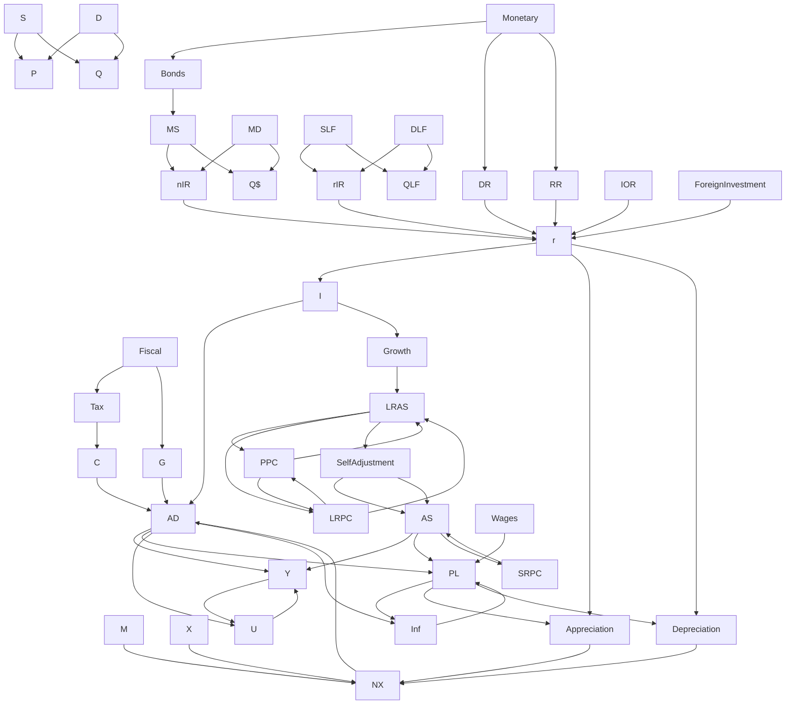

# GraphGPT
```
🚧 WORK IN PROGRESS FOR THIS DOCUMENT
```


```svg
<svg width="500" height="500" class="m-auto">
    <line x1="50" y1="50" x2="50" y2="480" style="stroke:black;stroke-width:2"></line>
    <line x1="30" y1="450" x2="450" y2="450" style="stroke:black;stroke-width:2"></line>
    <line x1="130" y1="340" x2="400" y2="100" style="stroke:#106e20;stroke-width:4"></line>
    <line x1="130" y1="100" x2="400" y2="340" style="stroke:#b50202;stroke-width:4"></line>
    <line x1="265" y1="100" x2="265" y2="450" style="stroke:#8a8686;stroke-width:4"></line>
    <line x1="50" y1="220" x2="265" y2="220" style="stroke:#8a8686;stroke-width:2;stroke-dasharray:4,4;"></line>
    <text x="410" y="350" style="font-size:1.2em; font-style: italic;">AD</text>
    <text x="420" y="90" style="font-size:1.2em; font-style: italic;">SRAS</text>
    <text x="240" y="80" style="font-size:1.2em; font-style: italic;">LRAS</text>
    <text x="50" y="40" style="font-size:1.2em; font-style: italic;">PL</text>
    <text x="400" y="480" style="font-size:1.2em; font-style: italic;">rGDP</text>
    <circle r="5" cx="265" cy="220" fill="black"></circle>
    <circle r="5" cx="50" cy="220" fill="black"></circle>
    <circle r="5" cx="265" cy="450" fill="black"></circle>
</svg>
```

GraphGPT is a new machine-learning model tailored for educational purposes emphasizing intuition, logic, and visual presentation. Read the paper [here (link will be added shortly)]().  In this `README.md` file, I will be going over specific details that wasn't mentioned in the paper if you would like to learn more about how GraphGPT works.

**Abstract**
> In this paper, we introduce GraphGPT, a novel machine-learning approach designed for intuitive, logical, and visual education. GraphGPT is inspired by the observation that scientific graphs help learners visualize concepts, while causal graphs enhance the logic of responses. By combining the masked prediction capabilities of GPT with transform prediction using causal graphs, we can improve explanation accuracy. GraphGPT generates logical steps alongside diagrams, significantly enhancing intuition and visual presentation compared to ChatGPT. Experimental results show that GraphGPT outperforms ChatGPT by 25\% in accuracy for multiple-choice questions. Furthermore, a vast majority of participants in the subjective tests confirmed that GraphGPT surpasses ChatGPT in all four evaluation categories. Many highlighted the diagrams and graphical explanations as key factors, giving GraphGPT a notable intuitive advantage.


## Why GraphGPT over Text-Based GPTs?
Many students learn better in a classroom with a teacher explaining or even with a peer tutor than at home, reading a textbook. Why? This is because when someone is taught a topic in person, they are learning it intuitively and often visually, on a whiteboard. Modern AI technologies such as ChatGPT cannot accomplish this as they are a text model. However, ChaGPT understands the struggles of students learning intuitively and bridges this gap in AI Education.

Learning with graphs and diagrams offers countless advantages such as
- **Graphs never lie.** Sometimes, your intuition or logic might not be the answer.
- **Graphs are memorable.** During a timed test, its much easier to draw one graph and shift the lines than going through each step, and even risk making silly mistakes.
- **Graphs are intuitive.** Often, definitions or relationships might not make sense for a student new to the subject. However, with graphs, its much more straightforward.
- **Visual Learning.** Many students are visual learners and would prefer to "see" concepts in front of them

## 💰 Macroeconomics (Example of GraphGPT)
> Credits to [Alex Chen](https://github.com/dynoscord) for helping me with this

**Macroeconomics** is a social science that studies the performance, structure, behavior, and decision-making of an economy of a country as a whole. 

There are 6 key graphs in Macroeconomics:
- Supply & Demand
- PPC (Production Possibilities Curve)
- AD/AS (Aggregate-Demand/Aggregate-Supply)
- Philips Curve
- Money Market
- Loanable Funds

Key Formulas
- $AD = C+I+G+X$
- $r = nIR - eIR$


### Variables
| Symbol | Meaning                   |
|--------|---------------------------|
| S      | Supply                    |
| D      | Demand                    |
| C      | Consumer Spending         |
| I      | Investment Spending       |
| G      | Government Spending       |
| X      | Exports                   |
| M      | Imports                   |
| NX     | Net Exports               |
| AD     | Aggregate Demand          |
| AS     | Aggregate Supply          |
| PL     | Price Level               |
| Y      | Output                    |
| SRPC   | Short Run Philips Curve   |
| U      | Unemployment              |
| Inf    | Inflation                 |
| MS     | Money Supply              |
| DR     | Discount Rate             |
| IoR    | Interest on Reserve       |
| r      | Interest Rate             |
| nIR    | Nominal Interest Rate     |
| rIR    | Real Interest Rte         |
| SLF    | Supply of Loanable Funds  |
| DLF    | Demand of Loanable Funds  |
| QLF    | Quantity of Loanable Funds|
| Q$     | Quantity of Money         |

### Macroeconomics Causal Graph 


### Macroeconomics Graphs


#### PPC


#### Supply & Demand
#### AD/AS

#### Philips Curve
#### Money Market
#### Loanable Funds


### Questionaire
Questionaire is linked [here](https://docs.google.com/document/d/1aQat4cVoHsBqe1YZONiW4iaPVp-nlCsoxwKSrpdNQCY/edit).


### Text-Processing and Rendering
### List of Commands
| Command          |                                         Operands                                        |                                         |
|------------------|:---------------------------------------------------------------------------------------:|----------------------------------------:|
| `NEW`            |       `PPC`, `Supply/Demand`, `AD/AS`, `Philips`, `Money Market`, `Loanable Funds`      |                     Initiates new graph |
| `LEFT`           |     `Demand`, `Supply`, `AD`, `AS`, `LRAS`, `SRPC`, `LRPC`, `MS`, `MD`, `SLF`, `DLF`    |                 Shifts a line leftwards |
| `RIGHT`          |     `Demand`, `Supply`, `AD`, `AS`, `LRAS`, `SRPC`, `LRPC`, `MS`, `MD`, `SLF`, `DLF`    |                Shifts a line rightwards |
| `OUTWARDS`       | `PPC`                                                                                   | Equivalent to Right, used for `PPC`     |
| `INWARDS`        | `PPC`                                                                                   | Equivalent to Left, used for `PPC`      |
| `LEFTPOINT`      | `Demand`, `Supply`, `AD`, `AS`, `LRAS`, `SRPC`, `LRPC`, `MS`, `MD`, `SLF`, `DLF`        | Shifts the equilibrium point leftwards  |
| `RIGHTPOINT`     | `Demand`, `Supply`, `AD`, `AS`, `LRAS`, `SRPC`, `LRPC`, `MS`, `MD`, `SLF`, `DLF`        | Shifts the equilibrium point rightwards |
| `UPPOINT`        | `PPC`                                                                                   | Same as RightPoint, used for `PPC`      |
| `DOWNPOINT`      | `PPC`                                                                                   | Same as LeftPoint, used for `PPC`       |
| `INCREASE`       | `C`, `I`, `G`, `X`, `r`, `rIR`, `nIR`, `QLF`, `Q$`, etc.                                | Indicates an increase in a Variable     |
| `DECREASE`       | `C`, `I`, `G`, `X`, `r`, `rIR`, `nIR`, `QLF`, `Q$`, etc.                                | Indicates an increase in a Variable     |
| `FISCALPOLICY`   | `Increase Tax`, `Decrease Tax`, `Increase Spending`, `Decrease Spending`                | Shows any fiscal policy taken           |
| `MONETARYPOLICY` | `Increase IoR`, `Decrease IoR`, `Buy Bonds`, `Sell Bonds`, `Increase DR`, `Decrease DR` | Shows any monetary policy taken         |
| Anything Else    | Anything                                                                                | Treated text instructions               |

### Macroeconomics Dataset Example Questions
> At this time, I am unable to reveal the entire dataset but a significant amount will be listed below.

What happens to equilibrium quantity and price after an increase in demand?
> `[NEW "Supply/Demand"]` We use a supply and demand model to model this question.  `[RIGHT "D"]`  `[INCREASE "Price]` `[INCREASE "Quantity"]` As a result of the shift, Price and Quantity both increase.

## Further Applications to Various Subjects
```
🚧 WORK IN PROGRESS
```

### 🛒 Microeconomics
Graphs and Diagrams in Microeconomics include:
- Supply/Demand
- PPC (Possibilities Production Curve)
- International Trade with Tarrifs
- Perfect Competition
- Monopoly
- Natural Monopoly
- Monopolistic Competition
- Game Theory
- Labor Markets
- Monospony
- Externalities

### ⚡ Physics
Graphs in Physics include:
- Position-Time
- Velocity-Time
- Acceleration-Time
- Force-Time
- Force-Displacement

### 🧪 Chemistry
wip.

### $\pi$ Algebra
wip.

### $\triangle$ Geometry
wip.

### $\int$ Calculus
Concepts in Calculus that can be explained visually can be:
- Integration
  - Riemann Sums
- Differentiation
  - Relationship between multiple degrees of differentiation for the same function
  - Instantaneous Slope
